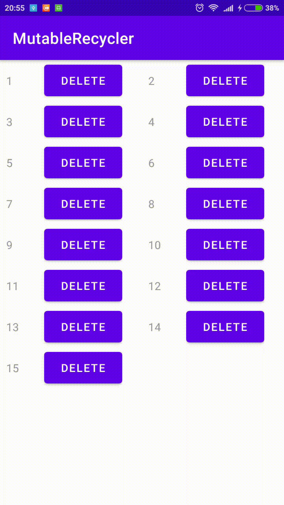

# MutableRecycler
1. У элемента отображается его номер и кнопка удалить
2. Раз в 5 секунд добавляется новый элемент на случайную позициию
3. Номер элемента все время наращивается
5. Добавления и удаления производятся с анимацией
6. Вся эта система поддерживает поворот экрана и продолжает работать после него
7. Существует пулл номеров удаленных элементов и новые добавлять из пула, и если там пусто просто наращивать номер
8. В вертикальном положении сделать две колонки, в горизонтальном четыре

